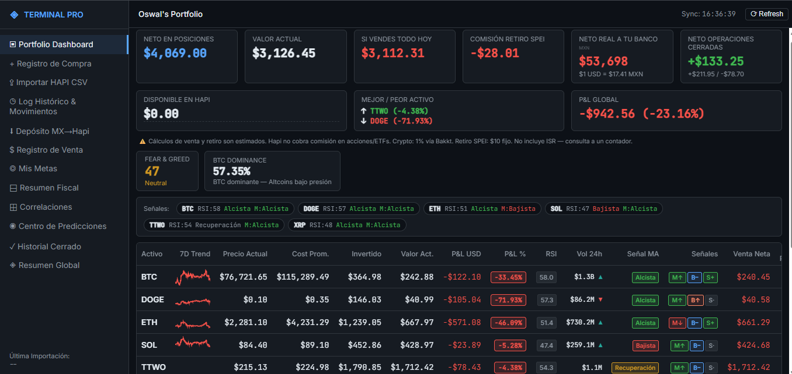
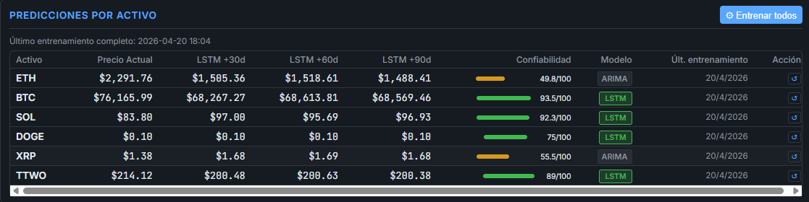
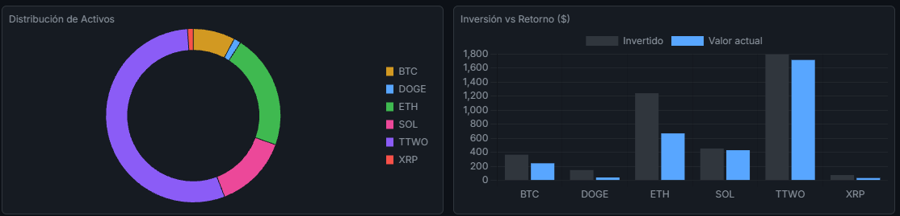
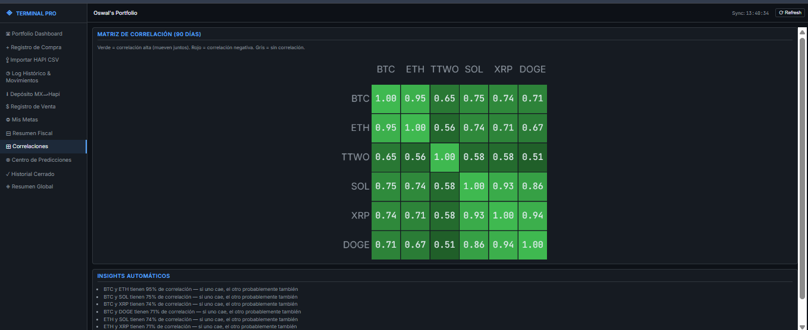
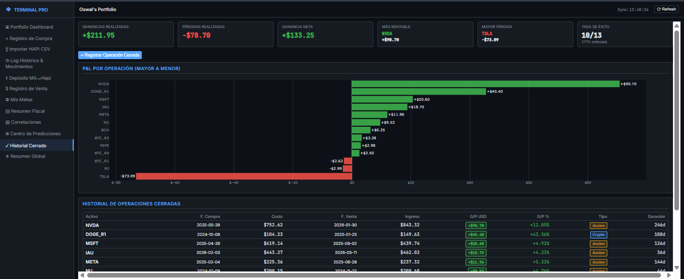
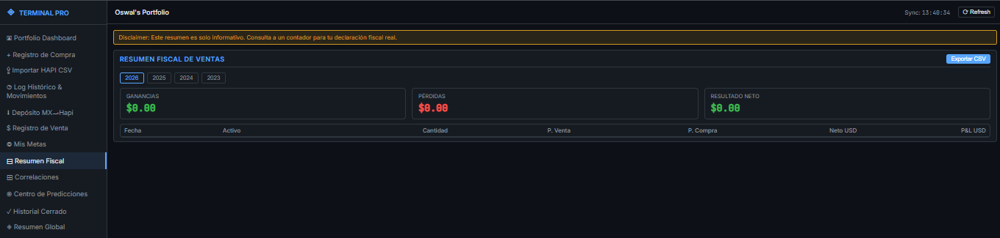

<div align="center">

# Portfolio Analytics Terminal

**A self-hosted, real-time portfolio dashboard with ML price predictions, technical indicators, and full accounting for crypto & stocks.**

[](https://python.org)
[](https://flask.palletsprojects.com)
[](https://pytorch.org)
[](https://www.chartjs.org)
[](LICENSE)
[]()

</div>

---

> A terminal-style web dashboard that turns your crypto and stock holdings into a fully instrumented analytics hub — complete with LSTM neural network predictions, ARIMA forecasting, 14+ technical indicators, and regulatory-ready tax reporting. Runs entirely on your machine.

---

## Screenshots

> _Screenshots coming soon. Run the app locally and add yours here._

| Dashboard | ML Predictions | Technical Indicators |
|-----------|---------------|----------------------|
|  |  |  |

| Correlation Matrix | Trade History | Tax Report |
|--------------------|---------------|------------|
|  |  |  |

---

## Features

### ML Predictions
- **LSTM Neural Network** — 3-layer PyTorch model (128→64→32 hidden units) trained on 13 features including price, volume, RSI, MACD, Bollinger Bands, MA50/200, sentiment score, Fear & Greed Index, and BTC dominance
- **ARIMA Forecasting** — Automatic order selection with 90-day price forecasts and 95% confidence intervals
- **Monte Carlo Dropout** — 20 forward passes to generate uncertainty bands (±1.96σ) around LSTM predictions
- **Hybrid BUY/HOLD/SELL Signal** — Weighted scoring combining LSTM direction, RSI, MACD momentum, sentiment, and market fear; each signal includes human-readable reasoning
- **30 / 60 / 90-day horizons** — Interactive Plotly forecast charts with confidence bands
- **Reliability score** — Per-model MAPE + directional accuracy metric surfaced in the UI
- **Auto-retraining** — APScheduler triggers fresh LSTM training every Sunday at 2 AM

### Technical Indicators
- RSI (14 period) with overbought / oversold zones
- MACD (12/26/9) histogram trend signal
- Bollinger Bands (20 period, k=2) with band-position classification
- MA50 / MA200 crossovers — Golden Cross / Death Cross detection
- Trend state labels: _Alcista fuerte_, _Recuperación_, _Lateral_, _Bajista_
- 24h trading volume (Binance for crypto, Yahoo Finance for stocks)
- News sentiment score from CryptoPanic + CoinDesk RSS
- Fear & Greed Index (CoinGecko) and BTC Dominance (CoinPaprika)

### Real-time Portfolio KPIs
- Portfolio total value, global P&L (USD and %)
- Per-asset: price, quantity, average cost, invested capital, current value, P&L, distance to break-even
- Best / worst performer by percentage
- Net balance after commissions (Hapi, Bakkt, SPEI)
- Live USD→MXN FX conversion for withdrawal calculations
- 10 draggable KPI cards with `localStorage` persistence
- Break-even alerts, 10% additional-drop warnings, stop-loss breach notifications

### Dashboard Sections
| Section | Description |
|---------|-------------|
| **Dashboard** | Live KPI cards, market bar, signal badges, portfolio table with 7-day sparklines |
| **Centro de Predicciones** | ARIMA + LSTM forecast charts with signal rationale |
| **Correlaciones** | Pearson correlation heatmap across all assets |
| **Registro de Compra / Venta** | Add buys and sales with commission-aware P&L |
| **Importar HAPI CSV** | Bulk-import trade history from exchange export |
| **Mis Metas** | Per-asset stop-loss / take-profit target configuration |
| **Resumen Fiscal** | Year-over-year realized gains/losses for tax filing |
| **Resumen Global** | Total deposited, withdrawn, realized P&L, commissions |
| **Historial Cerrado** | Full audit trail of all closed positions |
| **Log Histórico** | Portfolio value history chart (48h rolling window) |
| **Depósito MX → Hapi** | Record MXN deposits with live exchange rate |

---

## Tech Stack

### Backend
| Library | Purpose |
|---------|---------|
| **Flask** | HTTP server, REST API routing |
| **PyTorch** | LSTM model training and inference |
| **scikit-learn** | MinMaxScaler, preprocessing pipelines |
| **statsmodels** | ARIMA time-series modeling |
| **pandas / numpy** | Data manipulation and indicator math |
| **APScheduler** | Weekly LSTM retraining cron job |
| **requests** | HTTP client for all external APIs |

### External APIs
| API | Data |
|-----|------|
| **Binance REST** | Real-time crypto prices, 1h OHLCV candles |
| **Finnhub** | Stock quotes and fundamentals |
| **CoinGecko** | Crypto historical OHLCV (LSTM training) |
| **CryptoPanic** | News feed for sentiment analysis |
| **ExchangeRate-API** | Live USD→MXN conversion |
| **CoinPaprika** | BTC dominance |

### Frontend
| Library | Purpose |
|---------|---------|
| **Vanilla JS** | No framework dependency |
| **Chart.js** | KPI donut/bar charts, sparklines |
| **Plotly** | Interactive forecast charts with confidence bands |
| **PapaParse** | CSV parsing for trade import |
| **IntersectionObserver** | Lazy-loading sparklines |

---

## Installation

### Prerequisites
- Python 3.10+
- pip
- Binance account (free) for crypto prices
- Finnhub API key (free tier) for stock quotes

### 1. Clone the repository

```bash
git clone https://github.com/your-username/portfolio-analytics-terminal.git
cd portfolio-analytics-terminal
```

### 2. Create a virtual environment

```bash
python -m venv .venv

# Linux / macOS
source .venv/bin/activate

# Windows
.venv\Scripts\activate
```

### 3. Install dependencies

```bash
pip install flask torch scikit-learn statsmodels pandas numpy \
            apscheduler requests plotly
```

> **GPU support (optional):** Install the CUDA-enabled PyTorch build from [pytorch.org](https://pytorch.org/get-started/locally/) for faster LSTM training.

### 4. Configure API keys

Create `api_keys.json` in the project root:

```json
{
  "finnhub_key": "YOUR_FINNHUB_KEY",
  "coingecko_key": ""
}
```

> CoinGecko public tier works without a key (rate-limited to 30-second intervals). A free API key removes most limits.

### 5. Configure your portfolio

Create `metas.json` with your per-asset trading goals:

```json
{
  "BTC": { "stop_loss": 55000, "take_profit": 120000 },
  "ETH": { "stop_loss": 2800, "take_profit": 6000 }
}
```

### 6. Run the app

```bash
python app.py
```

Open [http://127.0.0.1:5000](http://127.0.0.1:5000) in your browser.

---

## Running as a Windows Service (optional)

Use [NSSM](https://nssm.cc) to run the app as a persistent Windows background service:

```powershell
# Install (run as Administrator)
.\install_service.ps1

# Uninstall
.\uninstall_service.ps1
```

Or use the batch launcher:

```bat
run_flask.bat
```

---

## API Reference

All endpoints return JSON. The frontend polls these automatically, but you can also query them directly.

| Method | Endpoint | Description | Cache TTL |
|--------|----------|-------------|-----------|
| `GET` | `/api/data` | Portfolio snapshot — prices, values, P&L, alerts | 60s |
| `GET` | `/api/sparklines` | 168-hour candles for mini-charts | 180s |
| `GET` | `/api/indicators` | Technical indicators for all assets | 180s |
| `GET` | `/api/correlations` | Pearson correlation matrix | — |
| `GET` | `/api/fear-greed` | Market sentiment index | 300s |
| `GET` | `/api/exchange-rate` | USD → MXN live rate | 3600s |
| `GET` | `/api/predict/<asset>` | ARIMA 90-day forecast | 30 min |
| `GET` | `/api/lstm/predictions/<asset>` | LSTM 30/60/90-day forecast | — |
| `GET` | `/api/lstm/signal/<asset>` | Hybrid BUY / HOLD / SELL signal | — |
| `GET` | `/api/fiscal` | Tax report (realized gains by year) | — |
| `GET` | `/api/resumen-global` | Aggregate accounting summary | — |
| `POST` | `/api/compras` | Log a new buy transaction | — |
| `POST` | `/api/ventas` | Log a new sale with P&L | — |
| `GET/POST` | `/api/goals` | Per-asset trading goal configuration | — |

---

## Project Structure

```
portfolio-analytics-terminal/
├── app.py                  # Flask server, all API routes, caching, threading
├── lstm_model.py           # PyTorch LSTM architecture, training, Monte Carlo inference
├── predictor.py            # ARIMA forecasting engine
├── indicators.py           # Technical indicator math, sentiment, Fear & Greed
├── templates/
│   └── index.html          # Single-page dashboard UI
├── static/
│   ├── css/style.css       # Dark terminal theme
│   └── js/app.js           # Frontend logic, Chart.js, Plotly, lazy loading
├── models/                 # Saved LSTM weights (.pt)
├── scalers/                # Fitted MinMaxScaler objects (.pkl)
├── predictions/            # Cached LSTM prediction JSON files
├── data/                   # Preprocessed LSTM training sequences (.npy)
├── api_keys.json           # API credentials (git-ignored)
├── metas.json              # Per-asset trading goals
├── compras.csv             # Buy transaction log
├── ventas.csv              # Sale transaction log
├── movimientos.csv         # Unified movement log
├── portfolio_log.csv       # Portfolio value history (48h rolling)
├── indicators_log.csv      # Technical indicator history (5760 rows)
├── install_service.ps1     # Windows NSSM service installer
├── uninstall_service.ps1   # Windows NSSM service remover
└── run_flask.bat           # Windows batch launcher
```

---

## LSTM Model Details

```
Input:  60-day sequences × 13 features
         └─ price, volume, RSI, MACD, Bollinger Bands,
            MA50, MA200, sentiment, fear/greed, BTC dominance

Architecture:
  LSTM(128) → Dropout(0.2)
  LSTM(64)  → Dropout(0.2)
  LSTM(32)  → Dropout(0.2)
  FC(16)    → FC(1)

Training:   Adam · MSE loss · Early stopping (patience=10) · Max 100 epochs
Inference:  Monte Carlo Dropout · 20 forward passes · ±1.96σ confidence bands
Retraining: Every Sunday at 02:00 via APScheduler
```

---

## Contributing

Contributions are welcome. Please open an issue first to discuss what you'd like to change.

1. Fork the repository
2. Create a feature branch: `git checkout -b feature/your-feature`
3. Commit your changes: `git commit -m 'feat: add your feature'`
4. Push to the branch: `git push origin feature/your-feature`
5. Open a Pull Request

---

## Roadmap

- [ ] Docker / docker-compose setup
- [ ] PostgreSQL backend (replace CSV files)
- [ ] Transformer-based price prediction model
- [ ] Email / Telegram alerts for stop-loss breaches
- [ ] Multi-user authentication
- [ ] Export portfolio report to PDF

---

## License

[MIT](LICENSE) © Oswaldo Ramírez

---

<div align="center">
Built with Flask · PyTorch · Chart.js · Plotly
</div>
